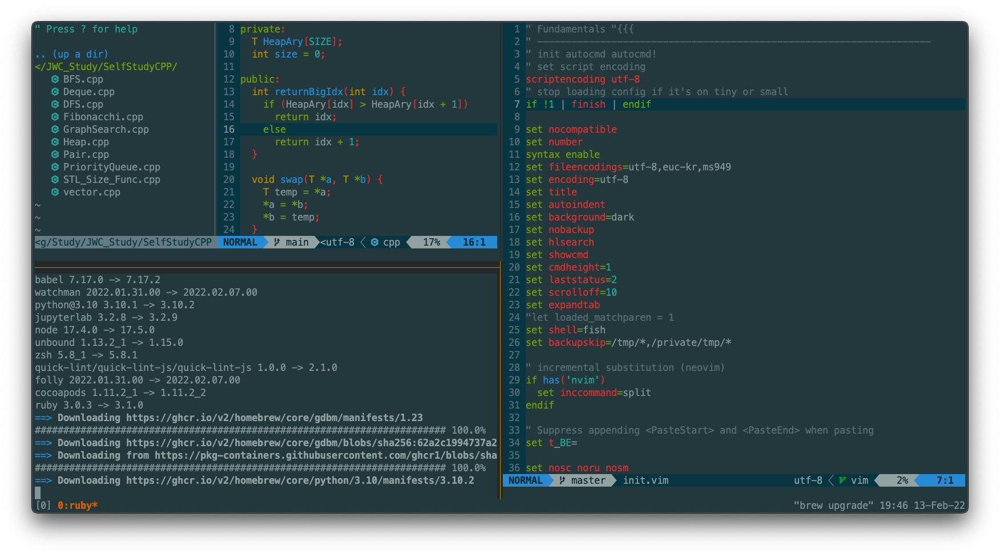

# JWC's Terminal Settings

터미널을 세팅하면서 전체적인 맥을 다루는 방법과 네오빔 및 개발 환경을 세팅하는 방법을 공부했습니다.

## This is My Terminal

> Basic Settings belongs to [Devaslife](https://www.youtube.com/c/devaslife)' dotfiles

## HomeBrew Package Manager

This is Basic Package Manager of MacOS.
Just Install it, and Use what i want.

### Brew Lists

 

Brew Packages Lists

- autojump  
- clang-format 
- cmake  
- exa  
- fasd  
- fish  
- git  
- neovim  
- tmux  
- tree-sitter  
- zsh  
- zsh auto suggestions  
- zsh syntax highlighting  

## Terminal

### Hyper

Checkout the '.hyper.js' file.
다양한 플러그인을 제공하며 여러 디자인으로 꾸미면서 사용할 수 있습니다.

### iTerm2

I follow devaslife iTerm2 setting. \
Basically, Theme is NeoSolarized. \
Control the blur options and transparency options status.

## Shells

> All of the Shell must have _vi mode_, _directory jumper_ and _command auto suggestions_.

### Zsh

The most used MacOS shell.
Using theme is 'powerlevel10k'.
I prefer agnoster style themes.

### Fish

After I watched devaslife terminal settings, I choose fish shell to use as second shell. \
Using Theme is 'bobthefish'. \
Also, I prefer agnoster style theme, so I choose it.
Checkout the 'fish.config' files in _".config/fish"_.

## Editors

### Neovims

I choose Neovim because of the Better developer enviorment. \
Neovim provides lots of plugins to use better than normal vim mode. \
Checkout the 'plug.vim' files in _".config/nvim"_ to find out what is in my plugin list.

### Vscode

Vscode is one of the most famous text editor.

## Fonts

- Hack Nerd Font
- D2Coding ligature

## Review

전반적으로 MacOS 및 컴퓨터 자체를 다루는 방법에 대해서 공부할 수 있었습니다. \
dotfiles들을 관리하면서 vi 편집기에 대해서 좀 더 배울 수 있었고,\
대부분의 자료가 영어였지만 스스로 찾아나가는 것들이 굉장히 재미있었습니다. \
또한 처음에는 많은 설정들을 단순히 따라해보는 수준에 그쳤지만, 원리를 정확히 찾아가다보니 많은 것을 학습할 수 있었습니다. \
특히 lspconfig를 다루면서 다양한 언어들에 대한 개발환경을 익힐 수 있었습니다. \
자신에게 맞는 다양한 설정들을 직접 찾아보면서 적용이 안되거나 오류가 발생하는 영역들을 많이 겪어볼 수 있었습니다. \
이후 드는 생각은 앞으로 새로운 기술들을 익힐 때 있어서 큰 두려움을 갖지 않아도 된다고 스스로에게 자신감을 심어줄 수 있는 좋은 기회였다고 생각합니다.
